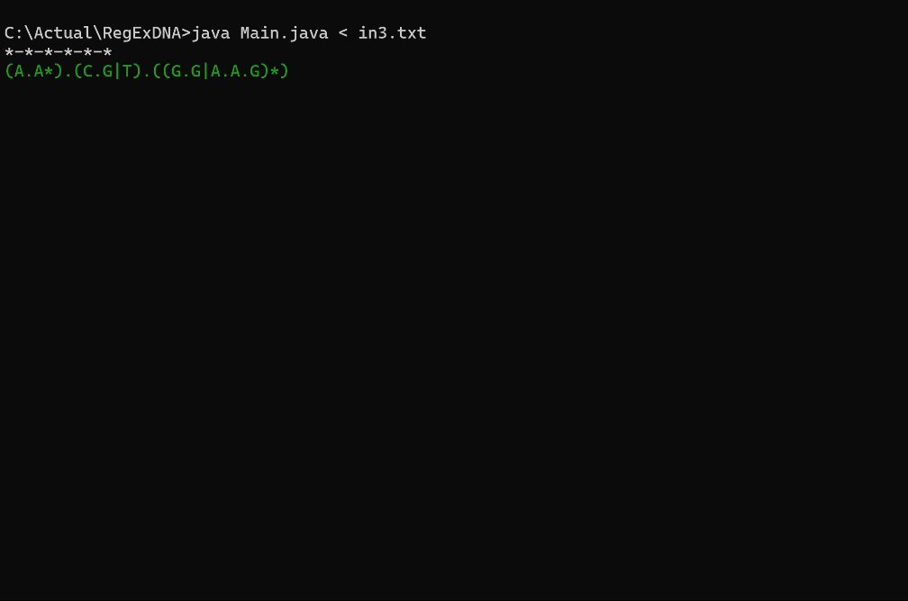

[](./README.md)

# Regular Expression Search in Computational Biology

This project focuses on the development of a regular expression search system with a specific focus on the context of computational biology. Through this README, I will provide an overview of the fundamental concepts behind regular expression search.

## Biological Context

In the realm of computational biology, regular expressions are fundamental for analyzing nucleotide and protein sequences. Here are some key concepts related to this context:

- **Genome:** The complete set of genetic material of an organism, including both coding genes and non-coding DNA.
- **Nucleotides:** The basic building blocks of DNA, represented by the nitrogenous bases Adenine (A), Thymine (T), Guanine (G), and Cytosine (C).
- **Codon Expansion:** The process by which specific codon sequences are expanded using regular expressions to analyze variations and mutations.

It's worth noting (which should come as no surprise to anyone) that the genome is immense, making this task challenging.


## Introduction to Regular Expressions

Regular expressions are sequences of characters that form a search pattern. They allow specifying complex patterns and performing efficient searches within text strings.

> Regular expressions are patterns used to find a certain combination of characters within a text string. Regular expressions provide a highly flexible way of searching or recognizing text strings. For example, the group consisting of the strings Handel, Händel, and Haendel can be described with the pattern H(a|ä|ae)ndel.
>
> \- Wikipedia

### Basic Components

- **Text:** The string in which the search is performed.
- **Pattern:** The set of characters being sought.
- **Occurrence:** Each time the pattern is found in the text.

### Example

```
Text: "Pepe Pecas pica papas con un pico, con un pico pica papas Pepe Pecas."
Pattern: "pic"
Occurrences: 8
```

## Operators in Regular Expressions

Regular expressions can contain operators that allow defining more complex patterns:

- **Union (`|`):** Represents the choice of one pattern or another.
- **Concatenation (`.`):** Joins two patterns to form a larger one.
- **Kleene Closure (`*`):** Indicates that the preceding pattern can be repeated zero or more times.

### Example

```
Patterns:
("pic" or "pec") or ("pep" or "pap")

Regular Expression:
p.(((i|e).c)|((e|a).p))
```

## Automata Theory and Automata Conversion

In this project, automata theory is used to implement regular expression search. It begins with non-deterministic finite automata (NFA) and converts them into deterministic finite automata (DFA) to optimize the search process. The conversion of an NFA to a DFA involves the following steps:

1. **Construction of State Set:** A set of states is generated representing all possible combinations of states from the NFA.

2. **Calculation of Transitions:** Transitions are calculated for each state of the DFA based on the transitions of the NFA.

3. **Minimization of DFA:** The resulting DFA is minimized to reduce the number of states and improve the efficiency of the algorithm.

Automata conversion is a fundamental process in implementing regular expression search as it allows optimizing the performance and accuracy of the system.

## Command Line Interface (CLI)



The program runs through a command-line interface (CLI), enabling simple interaction with the user. Upon running the program, the user will be prompted to input a regular expression and a text sequence on which to perform the search. The search result will be displayed in the console.


## Code Usage

The provided code implements a regular expression search system using automata theory. It's designed to analyze nucleotide sequences and find occurrences of specific patterns within them. To use the code, follow these steps:

1. Run the Main.
2. Provide a regular expression as input.
   (the in.txt files include examples of inputs)
3. Input the text sequence you want to search within.
4. The program will print the found occurrences and highlight the matching patterns in the text sequence.

---