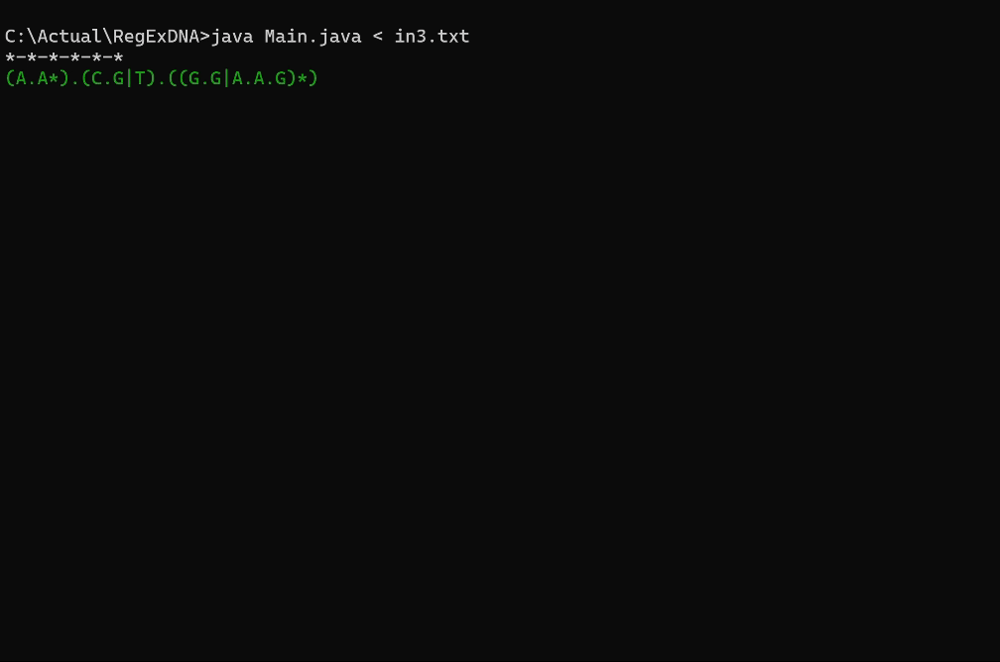
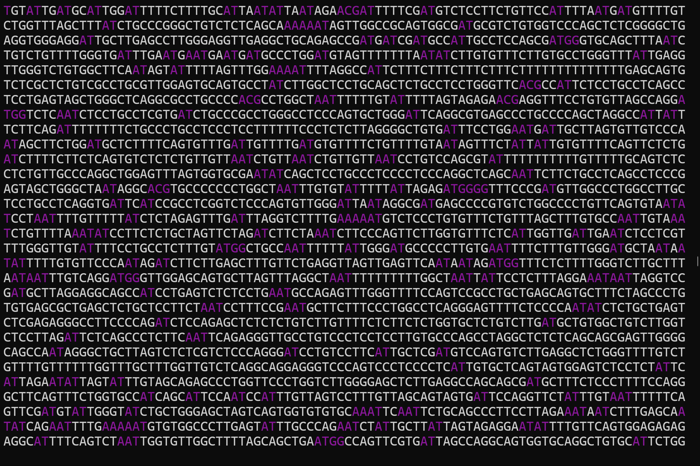

[](./README.md)
[](./README.en.md)

# Búsqueda de Expresiones Regulares en Biología Computacional

Este proyecto se centra en el desarrollo de un sistema de búsqueda de expresiones regulares con un enfoque específico en el contexto de la biología computacional. A través de este README, proporcionaré una visión general de los conceptos fundamentales detrás de la búsqueda de expresiones regulares.

## Contexto Biológico

En el ámbito de la biología computacional, las expresiones regulares son fundamentales para analizar secuencias de nucleótidos y proteínas. Aquí hay algunos conceptos clave relacionados con este contexto:

- **Genoma:** El conjunto completo de material genético de un organismo, que incluye tanto los genes codificantes como el ADN no codificante.
- **Nucleótidos:** Los bloques de construcción básicos del ADN, representados por las bases nitrogenadas Adenina (A), Timina (T), Guanina (G) y Citosina (C).
- **Expansión de Codones:** El proceso mediante el cual secuencias de codones específicas se expanden utilizando expresiones regulares para analizar variaciones y mutaciones.

Nótese (que no debería ser sorpresa para nadie) el genoma es inmenso, lo que dificulta esta tarea.


## Introducción a las Expresiones Regulares

Las expresiones regulares son secuencias de caracteres que conforman un patrón de búsqueda. Permiten especificar patrones complejos y realizar búsquedas eficientes dentro de cadenas de texto.

> Las expresiones regulares son patrones utilizados para encontrar una determinada combinación de caracteres dentro de una cadena de texto. Las expresiones regulares proporcionan una manera muy flexible de buscar o reconocer cadenas de texto. Por ejemplo, el grupo formado por las cadenas Handel, Händel y Haendel se describe con el patrón H(a|ä|ae)ndel.
>
> \- Wikipedia

### Componentes Básicos

- **Texto:** La cadena en la que se realiza la búsqueda.
- **Patrón:** El conjunto de caracteres que se está buscando.
- **Ocurrencia:** Cada vez que el patrón se encuentra en el texto.

### Ejemplo

```
Texto: "Pepe Pecas pica papas con un pico, con un pico pica papas Pepe Pecas."
Patrón: "pic"
Ocurrencias: 8
```

## Operadores de las Expresiones Regulares

Las expresiones regulares pueden contener operadores que permiten definir patrones más complejos:

- **Unión (`|`):** Representa la opción de uno u otro patrón.
- **Concatenación (`.`):** Une dos patrones para formar uno más grande.
- **Clausura de Kleene (`*`):** Indica que el patrón anterior puede repetirse cero o más veces.

### Ejemplo

```
Patrones:
("pic" o "pec") o ("pep" o "pap")

Expresión Regular:
p.(((i|e).c)|((e|a).p))
```

## Teoría de Autómatas y Conversión de Autómatas

En este proyecto, se utiliza la teoría de autómatas para implementar la búsqueda de expresiones regulares. Se comienza con autómatas no deterministas (AFN) y los se les convierte en autómatas finitos deterministas (AFD) para optimizar el proceso de búsqueda. La conversión de un AFN a un AFD implica los siguientes pasos:

1. **Construcción del Conjunto de Estados:** Se genera un conjunto de estados que representan todas las posibles combinaciones de estados del AFN.

2. **Cálculo de Transiciones:** Se calculan las transiciones para cada estado del AFD basándose en las transiciones del AFN.

3. **Minimización del AFD:** Se minimiza el AFD resultante para reducir el número de estados y mejorar la eficiencia del algoritmo.

La conversión de autómatas es un proceso fundamental en la implementación de la búsqueda de expresiones regulares, ya que permite optimizar el rendimiento y la precisión del sistema.

## Interfaz de Línea de Comandos (CLI)



El programa se ejecuta a través de una interfaz de línea de comandos (CLI), lo que permite una interacción sencilla con el usuario. Al ejecutar el programa, se solicitará al usuario que ingrese una expresión regular y una secuencia de texto sobre la cual realizar la búsqueda. El resultado de la búsqueda se mostrará en la consola.



## Uso del Código

El código proporcionado implementa un sistema de búsqueda de expresiones regulares utilizando la teoría de autómatas. Se ha diseñado para analizar secuencias de nucleótidos y encontrar ocurrencias de patrones específicos dentro de ellas. Para utilizar el código, sigue estos pasos:

1. Ejecuta el Main.
2. Proporciona una expresión regular como entrada.
   (los archivos in.txt incluyen ejemplos de entradas)
3. Ingresa la secuencia de texto sobre la cual deseas realizar la búsqueda.
4. El programa imprimirá las ocurrencias encontradas y resaltará los patrones coincidentes en la secuencia de texto.

---
